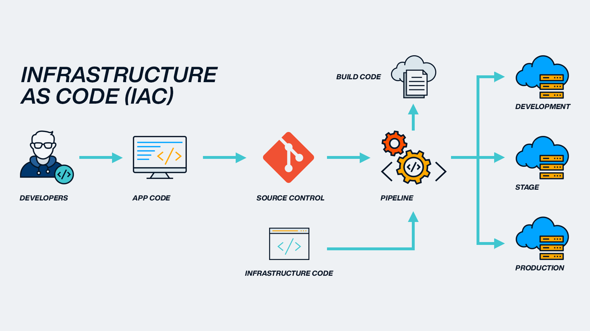

# Learning Infrastructure as Code
Infrastructure as Code (IaC) tools allow you to manage infrastructure with configuration files rather than through a graphical user interface. IaC allows you to build, change, and manage your infrastructure in a safe, consistent, and repeatable way by defining resource configurations that you can version, reuse, and share.

## Used Tools
| Tool | Description |
|------|-------------|
| Terraform | Is an infrastructure as code tool, developted by HashCorp company that lets you build, change, and version infrastructure safely and efficiently. |

## References
